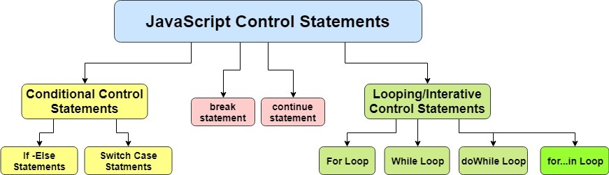

In JavaScript, control structures help determine the flow of your program based on specific conditions or repeated tasks. Here are some essential control structures explained in simple terms with examples:

**Conditionals:**

1. `if` statement: Executes a block of code if a specified condition is true.

   ```js
   if (x > y) {
     console.log("x is greater than y");
   }
   ```

2. `else if` statements: Add additional conditions after the initial `if`.

   ```js
   if (x === 1) {
     console.log("x equals 1");
   } else if (x === 2) {
     console.log("x equals 2");
   } else {
     console.log("x does not equal 1 or 2");
   }
   ```

3. `switch` statement: Compares a single expression against multiple values and executes the corresponding block of code.
   ```js
   switch (color) {
     case "red":
       console.log("Color is red.");
       break;
     case "blue":
       console.log("Color is blue.");
       break;
     default:
       console.log(`Unknown color ${color}`);
   }
   ```

**Loops:**

1. `while` loop: Repeats a block of code as long as a specified condition remains true.

   ```js
   let i = 0;
   while (i < 5) {
     console.log(i);
     i++;
   }
   ```

2. `do-while` loop: Similar to `while`, but always executes the loop body at least once.

   ```js
   let i = 0;
   do {
     console.log(i);
     i++;
   } while (i < 5);
   ```

3. `for` loop: Iterates over a range of numbers or collection elements.

   ```js
   for (let i = 0; i < 5; i++) {
     console.log(i);
   }
   ```

4. `for-in` loop: Used to iterate over the properties of objects.

   ```js
   const person = { name: "John", age: 30 };
   for (const prop in person) {
     console.log(`${prop}: ${person[prop]}`);
   }
   ```

5. `for-of` loop: Used to iterate over array items or iterables.
   ```js
   const arr = ["apple", "banana", "cherry"];
   for (const fruit of arr) {
     console.log(fruit);
   }
   ```

These control structures allow you to create dynamic programs that adapt their behavior according to changing input or conditions[1][2].

Citations:
[1] https://www.javascriptinstitute.org/javascript-tutorial/control-structures/
[2] https://www.tutorialspoint.com/internet_technologies/javascript.htm
[3] https://en.wikibooks.org/wiki/JavaScript/Control_structures
[4] https://codeinstitute.net/global/blog/control-flow-in-javascript/
[5] https://developer.mozilla.org/en-US/docs/Glossary/Control_flow

In addition to the basic control structures I have already described, here are some additional details from other resources to provide you with a comprehensive understanding of JavaScript control structures:

### Break and Continue Keywords:

The `break` keyword terminates the current loop iteration immediately, skipping any remaining code inside it. The `continue` keyword jumps directly to the next iteration of the same loop without executing the rest of the body of the loop.

### Labeled Statements:

A labeled statement provides a way to jump out of nested blocks using specific labels. This feature is not commonly used but may come in handy under certain circumstances.

```javascript
outerLoop:
for (let i = 0; i < 5; ++i) {
    innerLoop:
    for (let j = 0; j < 3; ++j) {
        if (someCondition) {
            break outerLoop; // Jump out of both loops
        }
        ....
    }
}
```

### Nested Control Structures:

You can use multiple control structures together to create complex logic flows. For example, nesting an `if` statement inside a `while` loop or combining several conditional statements into a single `switch`.

I hope this information helps you understand JavaScript control structures better! Remember, practice makes perfect, so try implementing these concepts in your own projects[1].

Citations:
[1] https://codehs.com/textbook/introjs_textbook/2

Sure, here are some more details on JavaScript control structures:

### Ternary Operator:

The ternary operator is a shorthand way of writing an `if-else` statement. It takes three operands: a condition, a value to return if the condition is true, and a value to return if the condition is false.

```javascript
condition ? value1 : value2;
```

### For-In Loop:

The `for-in` loop is used to iterate over the properties of an object. It executes a block of code for each property in the object.

```javascript
for (let property in object) {
  // code to be executed
}
```

### For-Of Loop:

The `for-of` loop is used to iterate over the values of an iterable object, such as an array or a string. It executes a block of code for each value in the iterable.

```javascript
for (let value of iterable) {
  // code to be executed
}
```

### Try-Catch Statement:

The `try-catch` statement is used to handle errors in JavaScript programs. The `try` block contains the code that might throw an error, and the `catch` block contains the code to handle the error.

```javascript
try {
  // code that might throw an error
} catch (error) {
  // code to handle the error
}
```

### Finally Block:

The `finally` block is used to execute code after a `try-catch` statement, regardless of whether an error was thrown or not.

```javascript
try {
  // code that might throw an error
} catch (error) {
  // code to handle the error
} finally {
  // code to be executed regardless of whether an error was thrown or not
}
```

I hope this additional information helps you understand JavaScript control structures even better!

To provide a complete overview of JavaScript control structures, let me cover two more topics:

### Arrow Functions with Shorter Syntax for Control Structures:

Arrow functions allow us to write shorter syntax for control structures like `map`, `filter`, and `reduce`. They also support the usage of implicit returns, which simplifies the implementation of control structures like `if-else` and `switch`.

```javascript
const squareNumbers = numbers.map((num) => num * num);
// instead of
const squareNumbers = [];
for (const num of numbers) {
  squareNumbers.push(num * num);
}

const filteredOddNumbers = numbers.filter((num) => num % 2 !== 0);
// instead of
const filteredOddNumbers = [];
for (const num of numbers) {
  if (num % 2 !== 0) {
    filteredOddNumbers.push(num);
  }
}

const summedArray = arr.reduce(
  (accumulator, currValue) => accumulator + currValue,
  0
);
// instead of
let sum = 0;
for (const val of arr) {
  sum += val;
}
sum;
```

### Async Await:

Async await is a modern approach to dealing with asynchronous operations in JavaScript. It introduces new keywords `async` and `await` that make working with promises easier by allowing developers to write synchronous-looking code that hides the complexity of callbacks and chaining promises.

```javascript
const getData = async () => {
  const response = await fetch("https://example.com");
  const data = await response.json();
  console.log(data);
};
getData();
```

With async await, we can easily implement control structures like loops and conditional statements around asynchronous tasks, making our code cleaner and easier to read.

I hope this additional information helps you gain a deeper understanding of JavaScript control structures! If you need more detailed explanations or examples, please refer to official documentation or online tutorials.
